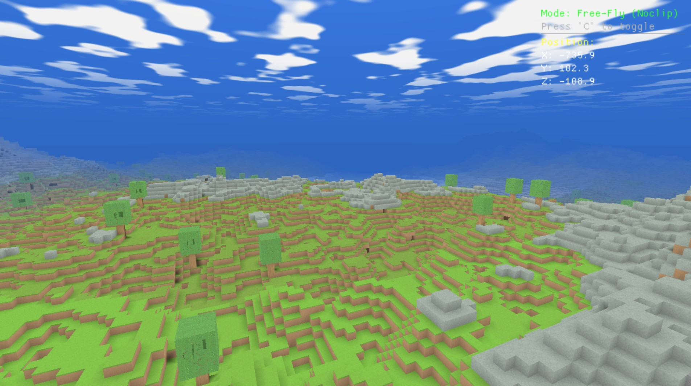
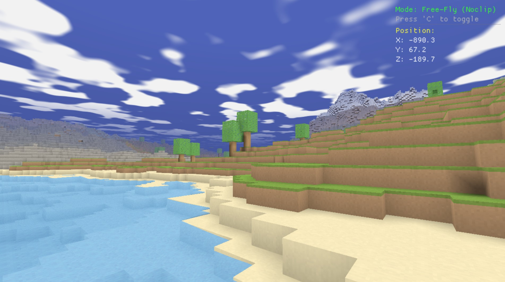
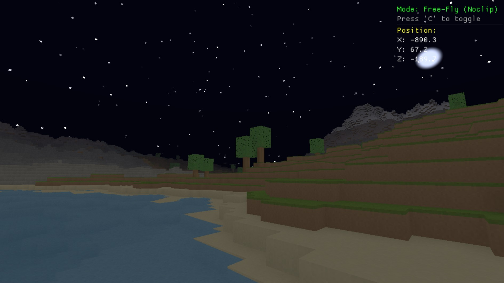
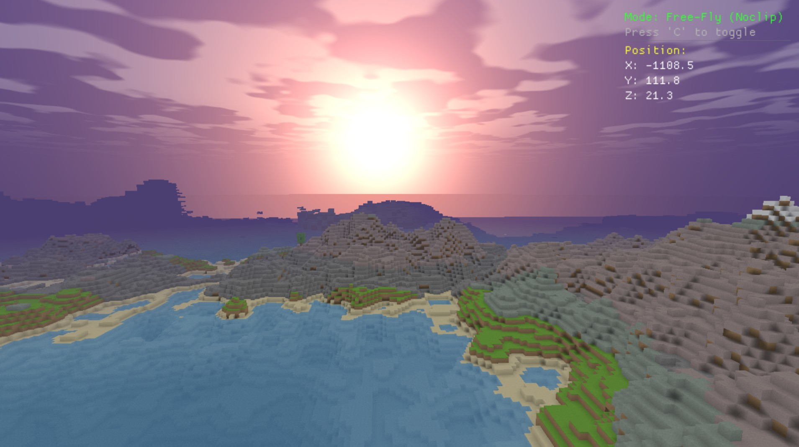
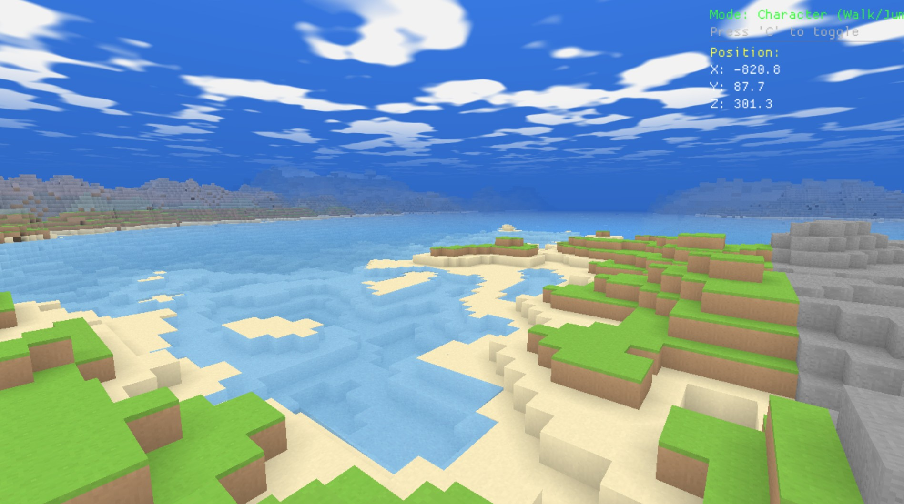

# WorldCraft

## Project on hold

This project was to see if the AI, with some human guidance and no human code added, could create a fully functional voxel-based world exploration game similar to Minecraft. The core systems were implemented, including procedural terrain generation, cave systems, LOD rendering, and block manipulation. However, the project is currently on hold as the AI-generated code requires significant manual refinement and optimization to reach a playable state.

However, I am putting this on hold for two reasons:

1. AI seems not to listen. I have given it very specific instructions on how to implement features, but it often ignores them and produces code that doesn't work or is inefficient. This leads to a lot of wasted time and effort trying to fix the AI's mistakes.
2. Cost. Running the AI for a project of this scope is expensive, and the amount of trial and error required to get it to produce usable code is not sustainable.

It is a shame, as I was enjoying the process and the project has a lot of potential. I may revisit it in the future when AI technology has improved and can better understand and follow instructions. For now, I will focus on other projects that are more manageable and less costly.

# The Brief


A high-performance voxel-based world exploration game built with modern C++20 and OpenGL, featuring procedurally generated terrain, dynamic cave systems, multi-level LOD rendering, and interactive block manipulation.



---

## 🎮 Current State

**Version:** Pre-Alpha Development Build  
**Status:** Core systems functional, actively developed

## 📸 Screenshots

<table>
  <tr>
    <td></td>
    <td></td>
  </tr>
  <tr>
    <td></td>
    <td></td>
  </tr>
</table>

---

### ✨ Implemented Features

#### World Generation
- **Procedural Terrain Generation** - Multi-biome world with realistic height variation
  - Plains, Deserts, Forests, Mountains, Tundra, and Ocean biomes
  - Seamless biome blending with smooth transitions
  - Configurable terrain amplitude, scale, and sea level
  - 8 grass variants and 8 rock surface variants for visual diversity

#### Cave Systems
- **Mountain Cave Entrances** - Rare, large cave openings on mountainsides
  - Visible from distance with debug beacon markers
  - Natural tube-like entrance tunnels
  - Configurable rarity and size parameters
- **Deep Cavern Networks** - Massive sealed underground chambers
  - Spawn between configurable depth ranges (default: Y 10-50)
  - Organic noise-based chamber formation
  - Natural ore and mineral deposits
- **Advanced Cave Lighting System** - Realistic sky-light propagation
  - Sky light floods down from surface through transparent blocks
  - Natural darkening in caves and underground areas
  - Smooth lighting transitions with multi-pass propagation
  - Per-block light storage with 16 brightness levels

#### Interactive Block System
- **Block Removal** - Point and click to break blocks
  - Visual targeting with wireframe highlight
  - Ray-cast selection system
  - Automatic inventory management with full inventory handling
  - When inventory is full, removed blocks are ejected as physics objects
  - Automatic chunk remeshing after block changes
  - Neighbor chunk updates for seamless edges
  - Delayed water scans after block removal prevent physics cascades
- **Block Physics System** - Realistic falling block mechanics
  - Gravity-based falling for unsupported blocks
  - Wall attachment detection (blocks with 2+ horizontal neighbors stay attached)
  - Collision detection and deflection (max 3 bounces)
  - Block destruction on high-energy impacts with particle effects
  - Settlement cooldown (0.5s) prevents immediate re-triggering after landing
  - Ghost block cleanup removes stuck falling blocks after 30 failed settlement attempts
  - Support validation ensures blocks only settle when properly supported
  - Energy-based destruction threshold with debris particle effects
- **Block Pickup and Throw** - G key interaction
  - Pick up blocks in character mode
  - Throw blocks with variable power based on hold duration
  - Physics simulation for thrown blocks with collision
  - Automatic water cavity detection and fill after physics events
- **Indestructible Bedrock Layer** - Bottom layer at Y=0 cannot be removed
- **Torch Lighting** - Dynamic light sources
  - Toggleable character torch (press T)
  - Torch block type with glowing texture
  - Adjustable brightness and falloff
  - Smooth lighting integration with sky-light system

#### Water System
- **Advanced Water Simulation** - Realistic water flow with intelligent fill mechanics
  - Scan-and-fill algorithm for cavity detection and water propagation
  - Delayed water scan queue (1-second delay) to stabilize block physics interactions
  - Zero-fill detection prevents infinite loops in sealed cavities
  - Follow-up scans ensure complete water coverage in complex cave systems
  - Configurable flow rate and update range
  - Water spreads to adjacent air blocks and falls downward with gravity
  - Toggleable in settings dialog with real-time flow rate adjustment
- **Water Wave System** - Animated water surfaces
  - Vertex displacement shader for realistic waves
  - Multiple wave layers with different frequencies
  - Toggleable via settings for performance
  - Edge-aware: no wave displacement on water block sides
- **Underwater Rendering** - Full underwater view effects
  - Blue-tinted fog when camera submerged
  - Smooth fog transitions
  - Proper rendering of water surface from below

#### Rendering System
- **5-Level LOD (Level of Detail) System**
  - LOD0 (full detail), LOD1 (1:2), LOD2 (1:3), LOD3 (1:4), LOD4 (1:6)
  - Interior-biased multi-point sampling for distant terrain
  - Smooth transitions between detail levels
  - Optimized chunk meshing with greedy mesh algorithm
- **Advanced Visual Effects**
  - Dynamic day/night cycle with time-of-day system
  - Procedural sky with sun, moon, and rotating star field
  - **Minecraft-style clouds** - Blocky, drifting clouds with day/night visibility
  - Zenith and horizon color gradients that change with time of day
  - Dawn/dusk orange horizon blush effect
  - Distance-based fog matching sky colors
  - Render-distance aware fog blending
  - Underwater rendering with caustics and fog
  - Ambient occlusion (AO) baking for realistic shadows
  - Gamma-corrected lighting (1/1.8 power curve)
  - Soft lighting curves for natural cave darkness

#### Chunk System
- **Infinite World Streaming**
  - Dynamic chunk generation and loading
  - Smart chunk eviction based on distance
  - Configurable render distance (default: 20 chunks)
  - Memory-stable operation (~2.7GB typical usage)
  - Fast generation supporting up to 40+ chunk render distance

#### Camera System
- **Dual Camera Modes**
  - **Fly Camera** - Free-flight noclip mode for exploration
  - **Character Camera** - Walking mode with full physics
	- Gravity and jumping mechanics
	- AABB collision detection
	- Ground detection
	- Eye-height view offset
- **Toggle between modes** - Press `C` to switch

#### User Interface
- **Real-time HUD Display**
  - World coordinates (X, Y, Z)
  - Current camera mode indicator
  - DPI-aware ImGui overlay
- **Settings Dialog** - Press F1 to open
  - World generation parameters (amplitude, scale, sea level)
  - Cave system configuration (rarity, size, depth ranges)
  - Visual effect toggles (water flow, waves, torch light)
  - Water flow rate adjustment
  - Render distance control (8-40+ chunks)
  - World preset selection (Default, Flat, Mountainous, Islands, Cave World)
  - Real-time settings updates

---

## 🎨 Block Types

WorldCraft features **36 unique block types** with procedurally generated seamless textures. All textures are generated at runtime using torus-domain Perlin noise for perfect tiling.

### Natural Terrain Blocks

| Block | Type | Side Texture | Top Texture | Description |
|-------|------|--------------|-------------|-------------|
| **Grass** | Solid | Dirt with green strip | Grass top | Standard grass block with 8 color variants |
| **Dirt** | Solid | Uniform | Uniform | Warm mid-brown earth |
| **Stone** | Solid | Uniform | Uniform | Cool grey stone base |
| **Sand** | Solid | Uniform | Uniform | Pale yellow sand with ripple patterns |
| **Gravel** | Solid | Uniform | Uniform | Coarse grey pebble texture |
| **Bedrock** | Solid | Uniform | Uniform | Indestructible dark base layer |
| **Snow Block** | Solid | White | White | Pure white snow, found in tundra/mountains |

### Vegetation Blocks

| Block | Type | Side Texture | Top Texture | Description |
|-------|------|--------------|-------------|-------------|
| **Wood** | Solid | Vertical grain | Ring pattern | Oak log with natural wood texture |
| **Leaf** | Transparent | Uniform | Uniform | Green foliage, semi-transparent |
| **Mushroom** | Solid | Uniform | Uniform | Decorative fungus block |

### Ore Blocks

All ore blocks feature stone base with colored mineral veins.

| Block | Type | Side Texture | Top Texture | Rarity | Description |
|-------|------|--------------|-------------|--------|-------------|
| **Coal Ore** | Solid | Uniform | Uniform | Common | Black coal deposits |
| **Iron Ore** | Solid | Uniform | Uniform | Common | Tan-orange iron veins |
| **Gold Ore** | Solid | Uniform | Uniform | Uncommon | Golden yellow deposits |
| **Redstone Ore** | Solid | Uniform | Uniform | Uncommon | Red redstone veins |
| **Lapis Ore** | Solid | Uniform | Uniform | Rare | Deep blue lapis lazuli |
| **Diamond Ore** | Solid | Uniform | Uniform | Very Rare | Cyan diamond crystals |
| **Emerald Ore** | Solid | Uniform | Uniform | Very Rare | Green emerald deposits |

### Special Blocks

| Block | Type | Side Texture | Top Texture | Description |
|-------|------|--------------|-------------|-------------|
| **Water** | Transparent | Uniform | Uniform | Semi-transparent animated water with wave system |
| **Obsidian** | Solid | Uniform | Uniform | Dark purple-black volcanic glass |
| **Torch** | Transparent | Uniform | Uniform | Light source block with glowing texture |

### Variant Blocks

- **Grass Variants (1-8)** - Different shades of green grass tops and sides for natural variation
- **Rock Variants (1-8)** - Weathered stone surfaces with varying patterns for mountains

---

## 🎯 World Presets

WorldCraft includes several pre-configured world generation presets:

### Default
Balanced terrain with all biomes, moderate mountains, trees, and full cave systems.
- **Terrain Amplitude:** 80.0
- **Terrain Scale:** 100.0
- **Sea Level:** 64
- **Caves:** Mountain entrances + Deep caverns

### Flat
Nearly flat terrain for building and testing.
- **Terrain Amplitude:** 3.0
- **Terrain Scale:** 300.0
- **Sea Level:** 50
- **Caves:** Disabled

### Mountainous
Dramatic mountain ranges with tall peaks.
- **Terrain Amplitude:** 120.0
- **Terrain Scale:** 80.0
- **Caves:** Enabled

### Islands
Archipelago world with raised sea level.
- **Terrain Amplitude:** 60.0
- **Sea Level:** 80
- **Caves:** Enabled

### Cave World
Enhanced cave generation for underground exploration.
- **Mountain Cave Rarity:** Increased
- **Mountain Cave Size:** Larger (30.0)
- **Cavern Size:** Larger (45.0)
- **Cavern Depth:** Deeper range (5-55)

---

## 🛠️ Technical Specifications

### Architecture
- **Language:** C++20 / C++17
- **Build System:** CMake 4.3.1-msvc1 with Ninja generator (minimum CMake 3.27.0)
- **Graphics API:** OpenGL with modern shader pipeline
- **Toolchain:** MSVC (Visual Studio 2026)

### Core Systems
- **Chunk System:** 16×256×16 voxel chunks
- **Meshing:** Greedy mesh algorithm with face culling
- **LOD Meshing:** Multi-level detail generation with interior-biased sampling
- **Noise Generation:** STB Perlin with torus-domain seamless tiling
- **Collision:** AABB-based player collision with swept volume testing
- **Lighting:** Sky-light propagation system with 16 brightness levels
- **Water Simulation:** Scan-and-fill cavity detection with delayed queue processing
- **Block Physics:** Gravity simulation, collision, deflection, and intelligent settlement
- **Ray-Casting:** Block targeting for interaction and removal

### Performance
- **Target Frame Rate:** 60+ FPS
- **Memory Usage:** ~2.7GB typical (20 chunk render distance)
- **Render Distance:** Configurable 8-40+ chunks
- **Chunk Generation:** Real-time streaming, no loading screens

### Dependencies
- **SDL2** - Window management and input
- **OpenGL** - Rendering
- **ImGui** - UI and debug overlays
- **GLM** - Mathematics library
- **STB** - Image loading and Perlin noise
- **Assimp** - Asset loading (planned)

---

## 🎮 Controls

### Fly Camera Mode (Default)
- **W/A/S/D** - Move forward/left/back/right
- **Space** - Move up
- **Left Shift** - Move down
- **Mouse** - Look around
- **Right Click** - Remove block (visual targeting with wireframe)
- **C** - Switch to Character Camera
- **T** - Toggle character torch light

### Character Camera Mode
- **W/A/S/D** - Walk forward/left/back/right
- **Space** - Jump
- **Mouse** - Look around
- **Right Click** - Remove block (visual targeting with wireframe)
- **G** - Pick up/throw block (hold for more power)
- **C** - Switch to Fly Camera
- **T** - Toggle character torch light

### UI
- **F1** - Toggle settings dialog
- **ESC** - Exit application

---

## 🏗️ Building from Source

### Prerequisites
- Visual Studio 2022 or later (2026 recommended)
- CMake 3.27.0 or later
- Ninja build system
- Windows 10/11 (currently Windows-only)

### Build Instructions

```bash
# Clone the repository
git clone https://github.com/MadFly-Team/WorldCraft
cd WorldCraft/Trunk

# Configure CMake
cmake -B out/build/x64-Release -G Ninja -DCMAKE_BUILD_TYPE=Release

# Build
cmake --build out/build/x64-Release

# Run
./out/build/x64-Release/WorldCraft/WorldCraft.exe
```

### Development Build
```bash
cmake -B out/build/x64-Debug -G Ninja -DCMAKE_BUILD_TYPE=Debug
cmake --build out/build/x64-Debug
```

---

## 📚 Documentation

Additional documentation can be found in the `docs/` directory:

- **[Chunk Optimizations](docs/ChunkOptimizations.md)** - LOD system, memory management, and rendering optimizations
- **[Cave Generation](docs/CaveGeneration.md)** - Cave system architecture and generation algorithms

---

## 🚀 Planned Features

### Short Term
- [x] Block breaking mechanics with visual targeting
- [x] Torch placement and lighting system
- [x] Skybox with day/night cycle
- [x] Dynamic sun/moon position and star rotation
- [x] Water flow simulation with scan-and-fill
- [x] Settings dialog with runtime configuration
- [x] Block physics with falling mechanics
- [x] Inventory full handling with block ejection
- [x] Block pickup and throw mechanics (G key)
- [ ] Block placement mechanics (expand on existing pickup/throw)
- [ ] Inventory UI display
- [ ] Save/load world data
- [ ] More torch types and light colors

### Medium Term
- [ ] Crafting system
- [ ] More biome types (jungle, swamp, badlands)
- [ ] Structure generation (villages, dungeons)
- [ ] Mob spawning and AI
- [ ] Sound effects and ambient audio
- [ ] Improved water physics (finite water)
- [ ] Weather systems (rain, snow)

### Long Term
- [ ] Multiplayer support
- [ ] Mod API
- [ ] Advanced weather systems
- [ ] Shader-based dynamic shadows
- [ ] Chunk LOD with geometry clipmaps
- [ ] Cross-platform support (Linux, macOS)

---

## 🤝 Contributing

This project is currently in early development. Contributions, suggestions, and feedback are welcome!

### Development Branch
Main development occurs on the `neil/develop` branch, please branch off this for any additions.

### Code Style
- Modern C++20 features preferred
- Follow existing naming conventions
- Comment complex algorithms
- Keep functions focused and modular

---

## 📜 License

*License information to be added*

---

## 🙏 Acknowledgments

### Third-Party Libraries
- **SDL2** - Cross-platform window and input management
- **ImGui** - Immediate mode GUI library
- **STB** - Single-file public domain libraries
- **GLM** - OpenGL Mathematics library
- **Assimp** - Asset import library

### Inspiration
WorldCraft draws inspiration from voxel games like Minecraft while exploring modern C++ techniques and rendering optimizations.

---

## 📞 Contact

**Repository:** [https://github.com/MadFly-Team/WorldCraft](https://github.com/MadFly-Team/WorldCraft)  
**Branch:** neil/develop

---

*Last Updated: January 2025*  
*Built with ❤️ using C++20 and OpenGL*
